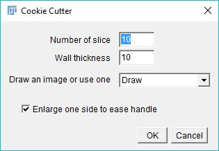

# cookie_cutter_ImageJ
## Source & cookie_cutter_ImageJ Result

## Dependencies
- [Fiji/Imagej](http://imagej.net/Fiji/Downloads)

## Usage to generate an Obj

1. Download [Macro_cookie_cutter.ijm](src/Macro_cookie_cutter.ijm)and Start Fiji
  
2. To install the macro, go to Plugins>Macro>Install and select the Macro_cookie_cutter.ijm
  
  
3. If the install is successful, you will see in the Plugins>Macro> the newly installed function
  
4. To set the parameters, you can press [F1]
  
  
  
5. To You can Draw and then press Ok
  
  
6. A window will pop up to save the ouput
  
  
  
7. It's done, you can use 

  
  
8. Open the results in your favarite 3D model viewer

  

As an alternative to drawing

1. You can use an image

2. When you set the parameters (pressing [F1]) you can leave the field for drawing empty.
  
 
3. A window will pop up to save the ouput, select the "draw" file
  
  

  

## Authors
@romainGuiet
